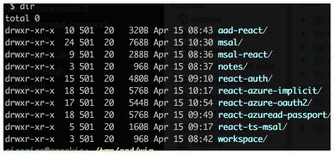

# React-MSAL-Notes

Clone me:

```
git clone git@github.com:cicorias/react-msal-notes notes
```

First you want to clone this and several other directories. Then there is a VS Code workspace file that you can open if you choose.

> Note the `msal` is cloned to a different path than normal.

```
git clone git@github.com:cicorias/aad-react
git clone git@github.com:cicorias/microsoft-authentication-library-for-js.git  msal
git clone git@github.com:cicorias/msal-react
git clone git@github.com:cicorias/react-auth
git clone git@github.com:cicorias/react-azure-implicit
git clone git@github.com:cicorias/react-azure-oauth2
git clone git@github.com:cicorias/react-azuread-passport
git clone git@github.com:cicorias/react-ts-msal

```

When done you should see something like the following:




## react-azuread-passport
another example using a SAME ORIGIN client and server - based on or related to `react-auth` below.
working client and server.

This uses SAME Origin hosting the client on `./dist`.

This has been trimmed down to ONLY AAD/ADFS. See `react-auth` for different strategies such as FB, etc.

## react-azure-oauth2
This is an example that uses `msal-js`, a fork of it, that will also work against the V1 endpoints.
Not sure if anything works on v2 endpoints.
But, the v1.3 is the last working one that I'm aware of. 
### Branches and tags
- master
- v1
- v1.1
- v1.3
- v2


## react-auth

working client and server SAME Orign. Refer to `react-azuread-passport` for pure AAD version.
This one has FB, etc. as alternative providers/stragegies and will use SQL persistence - see the `react-auth/server/routes/auth.js` file.

### server side
Implements passport with aad strategy, which effectively is OIDC.  While it has a Database connection information, that has been stubbed out.  

Only need to configure the AAD (which is tagged as ADFS - active directory federation services - in the `config.js`)

Uses middle ware to inspect every request.

## react-azure-implicit - 1 branch `dev`
really same as `react-azuread-passport` - 


## react-ts-msal
Nothing really done here..
### Branches
- dev - working branch
- master - scaffolded app

Scaffolded add that uses TypeScript. Created with `create-react-app my-app --scripts-version=react-scripts-ts`

## aad-react

Just a pure `isLoggedIn` checker component, nothing else. 

preliminary attempt that has in `components` what was to be a componentn nested/hosted within a page layout, like the header.

currently not wired up. Only client side (browser).

## msal-react

- generic examples in .NET, JS, etc. taken from MSAL repo samples (early) -- branch `components`
